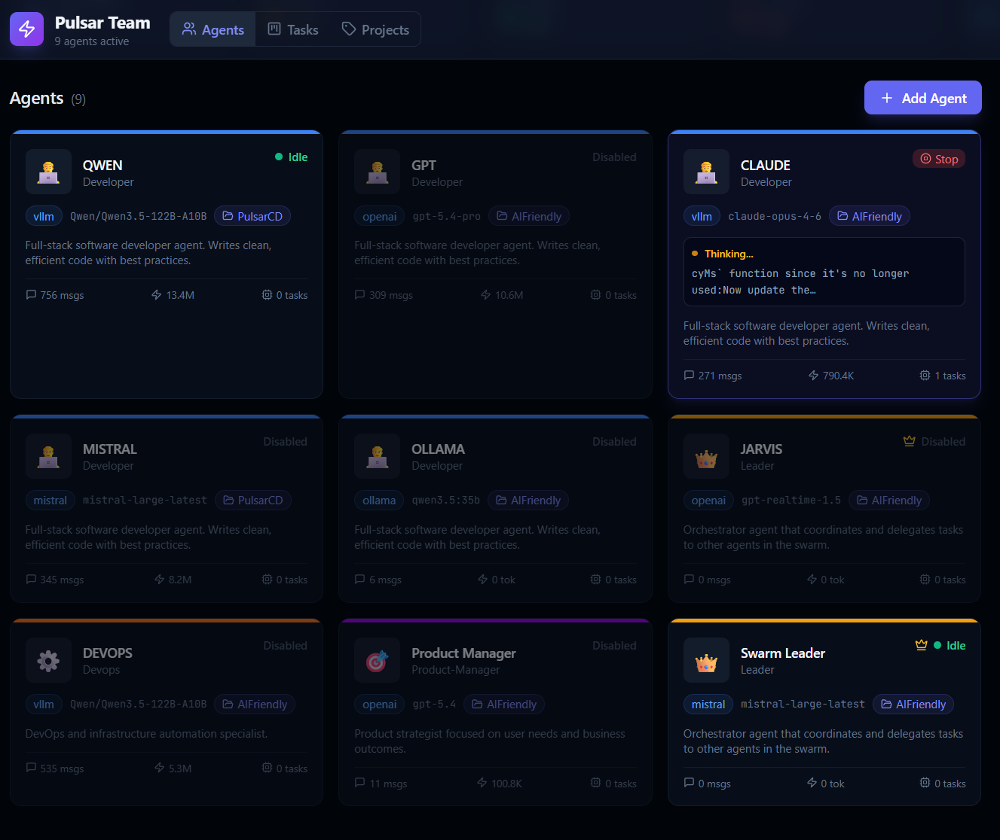
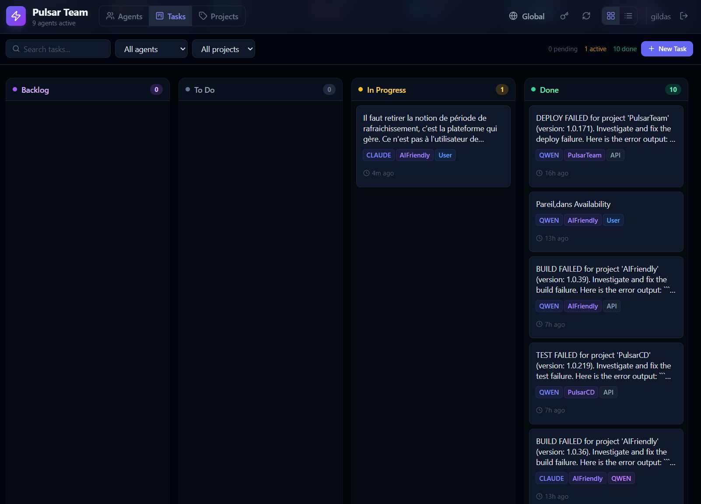
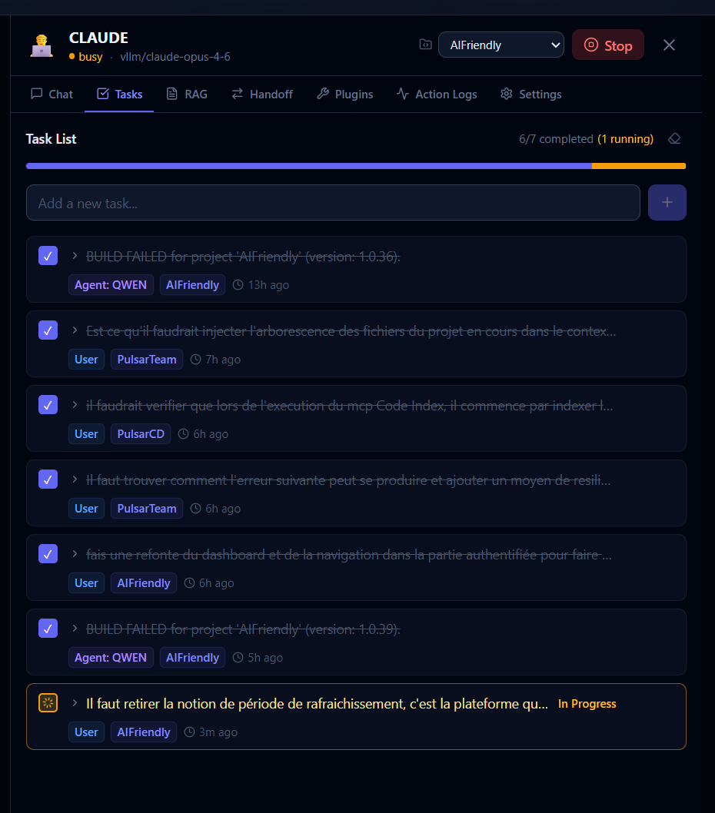
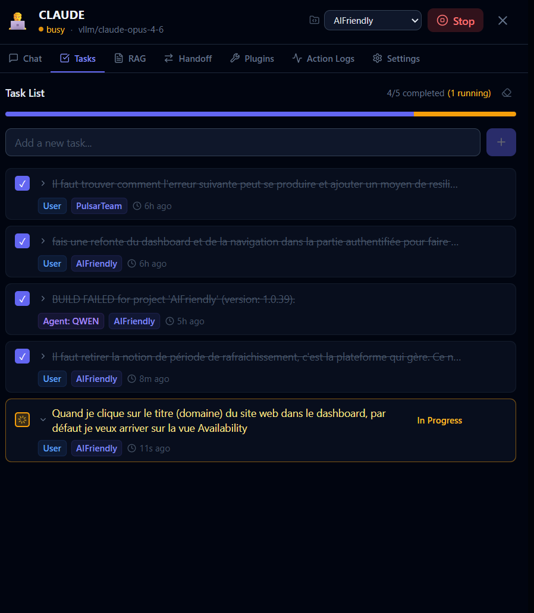

# PulsarTeam

A professional, real-time web interface for managing a swarm of AI agents. Built with the **Swarm pattern** (lightweight multi-agent orchestration with handoffs), supporting multiple LLM providers including vLLM, Ollama, GPT, Mistral and Claude (Anthropic).

## Features

### Agent Management



- **10 pre-built agent templates**: Swarm Leader, Developer, Architect, QA Engineer, Marketing, DevOps, Data Analyst, Product Manager, Voice Leader, Security Analyst
- **Custom agent creation** with full LLM configuration (model, provider, temperature, system prompt)
- **Color-coded** agent cards with real-time status indicators (idle / busy / error)
- **Per-agent metrics**: messages, tokens in/out, errors, last active time

### Scrum Board (Kanban)



- **4-column task board**: Backlog → To Do → In Progress → Done
- **Drag-and-drop** between columns
- Per-agent and per-project task lists
- Real-time status updates via WebSocket
- Task creation with agent assignment, project context, due date, and status tracking
- Source tracking (user, agent, API, or MCP-created tasks)

### Projects & Context



- **Project-scoped workspaces**: objective, rules/constraints, assigned agents
- Agents auto-switch context when assigned to a project
- Task statistics and progress tracking per project
- Project context injected into agent prompts

### Chat & Interaction



- **Per-agent chat** with full markdown rendering and syntax highlighting
- **Live streaming** of responses via WebSocket with thinking indicators
- **Conversation history** with timestamps
- **Global broadcast** (tmux-style): send a message to ALL agents simultaneously, view responses side-by-side

### Agent Handoffs (Swarm Pattern)
- **Delegate tasks** between agents with `@delegate(AgentName, "task")`
- Swarm Leader orchestrates multi-agent workflows: specs → delegation → result synthesis
- File and context transfer between agent workspaces

### Plugins & MCP (Model Context Protocol)
- **Plugin system** to extend agent capabilities with custom instructions and MCP tools
- **Create custom plugins** with icon, description, instructions, user config, and MCP server bindings
- **Plugin categories**: coding, devops, writing, security, analysis, general
- Assign multiple plugins per agent — tools are automatically injected into prompts
- **Built-in plugins**:
  - **Basic Tools** — file/command execution
  - **Delegation & Management** — agent coordination
  - **Agents Direct Access** — quick Q&A with other agents
  - **Swarm DevOps** — deploy projects to Docker Swarm
  - **OneDrive** — cloud file management (Microsoft Graph)
  - **Code Index** — codebase exploration and semantic search

### MCP Servers
- Agents interact with external tools via the **Model Context Protocol**
- Each plugin can bind one or more MCP servers (URL + optional bearer token auth)
- **Built-in MCP servers**:
  - **Swarm Manager** — Docker Swarm build/deploy pipelines, container management, log search
  - **OneDrive** — browse, search, read, upload files via Microsoft Graph
  - **Code Index** — index source folders, symbol extraction, semantic search (ZVEC-backed)
- **Custom MCP servers**: register any HTTP MCP endpoint with optional authentication

### Code Indexing (ZVEC)
- Index local source folders and extract symbols (classes, functions, methods)
- **Semantic search** via vector embeddings (ZVEC engine with in-memory fallback)
- Supports JavaScript/TypeScript and Python
- REST API: index, search symbols, semantic search, file tree, file outline

### RAG (Retrieval-Augmented Generation)
- Attach reference documents to any agent (.txt, .md, .json, .csv, .yaml)
- Documents injected into agent context for grounded responses

### Voice Chat
- **Speech-to-speech** via OpenAI Realtime API (Voice Leader agent)
- Live transcription, mute toggle, connection status
- Voice-controlled task delegation to other agents

### Sandbox Execution
- Isolated Docker container for agent code execution
- One Linux user per agent with project-scoped workspaces
- Git operations (clone, pull, push), file management, command execution
- Pre-installed dev tools: Node.js, Python, Go, C/C++, Docker CLI, kubectl, Chromium

### Coder Service (Claude Code)
- **FastAPI proxy** to Claude Code CLI running in headless mode
- Autonomous code execution agent with access to project files
- Full dev environment: Python 3.12, Node.js 22, Go, Docker CLI, PostgreSQL, Chromium
- OAuth PKCE authentication with token persistence
- Configurable model, max turns, and timeout

### Swarm API (External Integration)
- REST API for external systems to interact with the swarm (API key auth)
- `GET /api/swarm/agents` — list agents with filters (project, status)
- `GET /api/swarm/agents/:id` — detailed agent info
- `POST /api/swarm/agents/:id/tasks` — submit tasks to agents

### Security
- **JWT-based authentication** with login page
- API key authentication for external Swarm API
- OAuth PKCE for Claude Code CLI
- Bearer token support for MCP servers
- Default credentials: `admin` / `swarm2026`

## Architecture

```
┌──────────────────────────────────────────────────┐
│          Frontend (React 19 + Vite 6)            │
│  Dashboard · Agent Detail · Scrum Board          │
│  Broadcast · Voice Chat · Projects               │
└──────────────────┬───────────────────────────────┘
                   │ WebSocket + REST
┌──────────────────▼───────────────────────────────┐
│          API Server (Node.js + Express)           │
│  AgentManager · SkillManager · MCPManager         │
│  SandboxManager · CodeIndexService                │
└───┬──────────────┬──────────────┬────────────────┘
    │              │              │
    ▼              ▼              ▼
┌────────┐  ┌───────────┐  ┌───────────────┐
│Sandbox │  │  Coder    │  │  MCP Servers   │
│(Docker)│  │  Service  │  │  (HTTP)        │
│        │  │ (FastAPI) │  │                │
└────────┘  └───────────┘  └───────────────┘
                                    │
                   ┌────────────────┼────────────┐
                   ▼                ▼             ▼
             Swarm Manager    OneDrive      Code Index
```

## Tech Stack

- **Backend**: Node.js, Express, Socket.IO, JWT, PostgreSQL
- **Frontend**: React 19, Vite 6, Tailwind CSS, Lucide Icons
- **Coder Service**: Python, FastAPI, Claude Code CLI
- **LLM Providers**: Anthropic (Claude), OpenAI (GPT), Ollama, Mistral, vLLM
- **Infrastructure**: Docker Swarm, Traefik (reverse proxy + TLS), Nginx
- **Tooling**: MCP (Model Context Protocol), ZVEC (vector search)

## Getting Started

See the full installation guide: **[docs/GETTING_STARTED.md](docs/GETTING_STARTED.md)**

Quick deploy:

```bash
cd devops
cp .env.example .env       # Configure environment variables
./docker-compose.pre.sh    # Build & push images
docker stack deploy -c docker-compose.swarm.yml pulsarteam
./docker-compose.post.sh   # Verify services
```

Services are routed via **Traefik** with automatic HTTPS (Let's Encrypt).

## License

This project is licensed under the **GNU Affero General Public License v3.0 (AGPL-3.0)**.

- You are free to use, modify, and distribute this software
- If you modify PulsarTeam, you must release your changes under the same AGPL-3.0 license
- **Network use counts as distribution**: if you run a modified version of PulsarTeam on a server and let users interact with it over a network (SaaS, hosted service, etc.), you must make the complete source code available to those users
- This ensures that all improvements to PulsarTeam remain open, even when deployed as a service

See [LICENSE](LICENSE) for the full license text.
